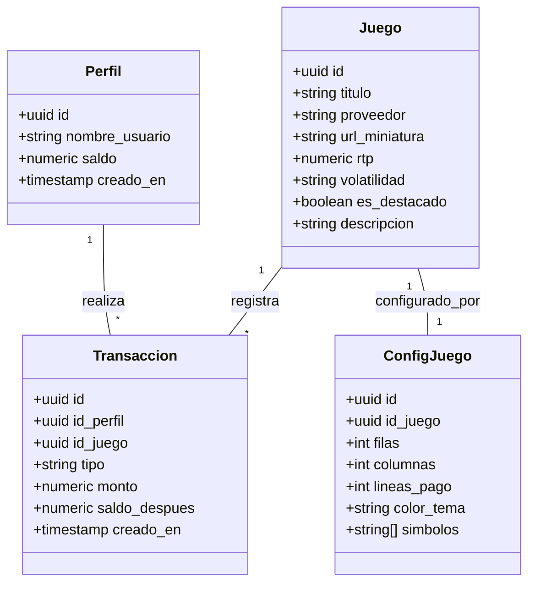

# Esquema UML - Base de Datos (Supabase/PostgreSQL)

```mermaid
classDiagram
    class Perfil {
        +uuid id
        +string nombre_usuario
        +numeric saldo
        +timestamp creado_en
    }
    
    class Juego {
        +uuid id
        +string titulo
        +string proveedor
        +string url_miniatura
        +numeric rtp
        +string volatilidad
        +boolean es_destacado
        +string descripcion
    }
    
    class ConfigJuego {
        +uuid id
        +uuid id_juego
        +int filas
        +int columnas
        +int lineas_pago
        +string color_tema
        +string[] simbolos
    }
    
    class Transaccion {
        +uuid id
        +uuid id_perfil
        +uuid id_juego
        +string tipo
        +numeric monto
        +numeric saldo_despues
        +timestamp creado_en
    }

    Perfil "1" -- "*" Transaccion : realiza
    Juego "1" -- "1" ConfigJuego : configurado_por
    Juego "1" -- "*" Transaccion : registra
```
